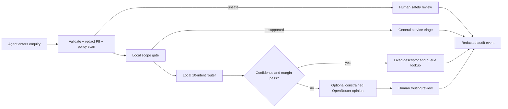

# BankRoute

BankRoute is a guarded decision-support prototype for first-line retail-banking agents. It reads a short English service enquiry, decides whether the enquiry belongs to a deliberately narrow supported slice, proposes one of ten specialist routes, explains the evidence, and sends uncertain or unsafe cases to a human.

It **does not** answer banking questions, authenticate a customer, approve or reject products, give financial advice, or execute any account action.

## Quick start

Python 3.9+ is recommended.

```bash
python3 -m venv .venv
source .venv/bin/activate
pip install -r requirements.txt
python app.py
```

Open `http://127.0.0.1:5000`. The trained artifacts and BANKING77 source data are included, so retraining is not required for the demo.

### Polished frontend

The repository also contains the English agent-facing presentation interface in `frontend/`.

```bash
cd frontend
npm ci
npm run dev
```

The frontend requires Node.js 22.13 or newer. Open the local address printed by the development server. It is a self-contained demonstration surface; the Python project remains the source of truth for trained artefacts, routing policy, evaluation, and tests.

OpenRouter is optional. If `OPENROUTER_API_KEY` exists in the server environment, the UI enables a constrained second-opinion toggle. The secret is never returned, logged, or written to an artifact. The complete local pipeline works without it.

## Problem and user

- **Primary user:** a first-line retail-banking service agent.
- **Job to be done:** route card-payment and ATM/cash-withdrawal enquiries to a specialist queue without forcing unrelated or ambiguous messages into a label.
- **AI purpose:** classification and decision support, not autonomous service resolution.
- **Supported input:** one English message, 3–500 characters.
- **Output:** scope score, suggested intent, top-three evidence, fixed queue, reason, decision status, privacy/safety flags, and tool trace.
- **Success criteria:** closed-set macro-F1 at least 0.85; at least 90% safe escalation for the 67 unused BANKING77 intents; valid closed-vocabulary output; observable latency and optional-model cost.

### Position in the service journey

Real banking channels may already ask customers to select a broad issue category before they reach an agent. BankRoute does not replace that upstream self-service layer. This prototype starts after a customer's free-text enquiry has reached a first-line service agent and focuses on the downstream decision of which specialist queue should handle it.

In a future production system, a customer-selected topic could be passed to BankRoute as optional metadata or used as a consistency check against the free-text enquiry. That integration is intentionally outside the scope of this prototype so the evaluation remains focused on agent-side routing from the customer's message itself.

## Supported intent pairs

The ten labels form five intentionally difficult **card payment vs ATM cash** pairs:

| Issue | Card route | ATM/cash route |
|---|---|---|
| Not recognised | `card_payment_not_recognised` | `cash_withdrawal_not_recognised` |
| Pending | `pending_card_payment` | `pending_cash_withdrawal` |
| Declined | `declined_card_payment` | `declined_cash_withdrawal` |
| Wrong exchange rate | `card_payment_wrong_exchange_rate` | `wrong_exchange_rate_for_cash_withdrawal` |
| Fee charged | `card_payment_fee_charged` | `cash_withdrawal_charge` |

Exact definitions, positive cues, exclusions, routes, and priorities live in [`src/bankroute/catalog.py`](src/bankroute/catalog.py). These descriptors are versioned product logic—not generated text.

## Architecture



The optional external model cannot invent a label, queue, or execute an action. It receives redacted text plus approved descriptors, must return JSON, and cannot override a failed deterministic acceptance gate.

## Build versus rent decision

The final architecture uses a **built local model as the primary router** and a **rented foundation model only as an optional reviewer**.

| Option | Evidence | Decision |
|---|---|---|
| Keyword rules | Macro-F1 0.496; 46% coverage on 400 in-scope test queries | Useful transparent floor, too brittle for production routing |
| Local TF-IDF + logistic regression | Closed-set macro-F1 0.940 on all 400 in-scope test queries; cheap, fast, private | Primary classifier |
| OpenRouter `openai/gpt-4o-mini` | Macro-F1 0.850 on a frozen 50-query sample; mean 1.78 s; estimated total US$0.0064 | Optional second opinion, not final authority |

For a bank, regulation and data governance normally dominate model novelty. This design keeps raw customer text and the final decision policy local. The external provider receives only redacted text when an agent explicitly enables the option.

## Guardrails that are actually implemented

1. Input type and 3–500 character validation.
2. Redaction of likely card numbers, account IDs, emails, and phone numbers before external processing and audit logging.
3. Detection of common prompt-injection and secret-exfiltration requests.
4. Rejection of transaction execution, credential changes, lending decisions, and investment advice.
5. Binary scope gate trained with all 67 unused BANKING77 labels as realistic out-of-scope data.
6. Closed ten-label vocabulary and deterministic queue mapping.
7. Confidence, top-two margin, and scope thresholds selected only on a training validation split.
8. Abstention and human review when any acceptance condition fails.
9. Safety-policy precedence over classification and scope decisions.
10. Redacted structured audit events; no API key or original unredacted message in browser responses.

## Reproduce the work

```bash
# Refit models and choose thresholds on training/validation data
python scripts/train.py

# Evaluate the frozen official test split
python scripts/evaluate.py

# Run fixed product/safety cases
python scripts/evaluate_edge_cases.py

# Optional: uses OPENROUTER_API_KEY, makes 50 external calls
python scripts/evaluate_openrouter.py

# Automated tests
pytest -q
```

The official test split is not used to fit features or tune thresholds. Random seeds and exact sample rules are stored in the scripts and artifacts.

## Verified results

| Measure | Result |
|---|---:|
| Official test rows | 3,080 |
| In-scope / OOS rows | 400 / 2,680 |
| Closed-set local model accuracy | 0.940 |
| Closed-set local model macro-F1 | 0.940 |
| Guarded macro-F1 with abstention | 0.921 |
| Accepted-route accuracy | 0.980 |
| In-scope coverage | 0.888 |
| OOS safe escalation | 0.974 |
| OOS false-route rate | 0.026 |
| Fixed edge cases | 20 / 20 passed |
| Automated tests | 16 / 16 passed |

Detailed outputs are in [`evals/results`](evals/results), including per-intent metrics, a confusion matrix, test predictions, edge-case results, and the optional OpenRouter comparison.

## Project map

```text
BankRoute/
├── app.py                     Flask demo and JSON API
├── artifacts/                 Trained models, thresholds, metadata, examples
├── data/raw/                  Exact BANKING77 train/test/category files
├── docs/                      Architecture, product specification, demo guide
├── evals/                     Fixed cases and reproducible results
├── frontend/                  Polished English agent-facing web demo
├── scripts/                   Train and evaluation entry points
├── src/bankroute/             Guardrails, models, tools, router, audit logic
├── static/ + templates/       Responsive demo interface
└── tests/                     Unit, integration, and API-contract tests
```

## Run checks without retraining

```bash
# Python tests
pytest -q

# Frontend production build
cd frontend
npm ci
npm run build
```

These commands do not retrain the model or rerun the frozen evaluation. The checked-in evaluation results remain under `evals/results/`. The existing frontend rendered-content test is retained unchanged, as required; it still asserts the former Chinese interface copy and therefore reports a stale wording assertion against the new all-English UI. The production build itself passes on Node.js 22.13+.

## Known limitations

- English only; spelling and paraphrase coverage follows BANKING77.
- This is a research prototype, not connected to real customer accounts or bank queues.
- Regex redaction reduces common PII exposure but is not a complete enterprise DLP system.
- The OOS benchmark uses the other BANKING77 intents and does not represent every real-world banking or adversarial request.
- Scores are not probabilities calibrated for regulatory decisioning; they are used only in a routing acceptance policy.
- Audit logs are local JSONL for demonstration; production would require authenticated access, retention controls, encryption, and monitoring.

## Data and licensing

The project uses the public [PolyAI BANKING77 dataset](https://github.com/PolyAI-LDN/task-specific-datasets/tree/master/banking_data), distributed under CC BY 4.0. Dataset details and file hashes are documented in [`data/README.md`](data/README.md). Project code is provided under the MIT License; the source dataset retains its own license.
