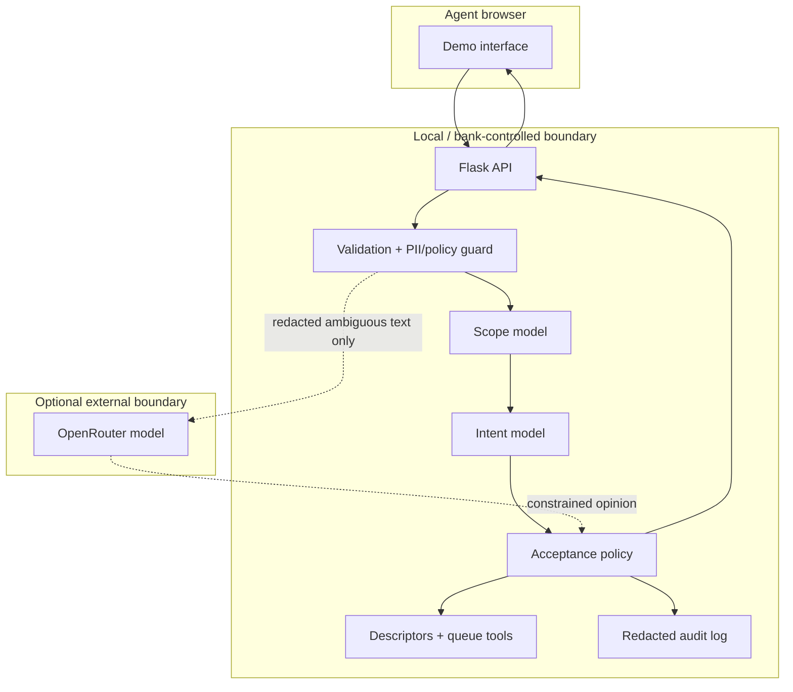

# Technical architecture

## Components

1. **Flask UI/API** — serves the demo and a small JSON API.
2. **Privacy and policy guard** — validates text, redacts common PII patterns, detects prompt injection and prohibited use.
3. **Scope gate** — binary TF-IDF/logistic model trained with the selected 10 labels as in-scope and the other 67 as OOS.
4. **Intent router** — ten-class word- and character-TF-IDF/logistic classifier.
5. **Decision policy** — applies validation-selected scope, confidence, and top-two margin thresholds.
6. **Deterministic tools** — intent descriptor, labelled-example retrieval, queue resolution, and cost estimation.
7. **Optional OpenRouter reviewer** — server-side, redacted, JSON constrained, candidate-label constrained, and unable to override a failed local gate.
8. **Audit sink** — redacted JSONL event log for demo observability.

## Data flow and trust boundaries



The unredacted original exists only long enough to validate and redact inside the process. API responses omit it. Audit events remove it. In a production implementation, transport encryption, access control, key management, DLP, retention, and a managed audit store would be mandatory.

## Model details

- Word TF-IDF: unigrams and bigrams, Unicode accent stripping, sublinear term frequency.
- Character TF-IDF: character-within-word 3–5 grams, up to 35,000 features.
- Classifier: balanced multinomial logistic regression, maximum 2,000 iterations.
- Reproducibility seed: 42.
- Artifacts: `scope_gate.joblib`, `intent_router.joblib`, `thresholds.json`, `metadata.json`, and `examples.json`.

Character features help with short/noisy phrasing, while logistic regression gives a strong, inexpensive and inspectable baseline. No embeddings or vector database are necessary at this dataset scale; adding either would increase operational complexity without evidence that it improves the measured target.

## API endpoints

| Method | Endpoint | Purpose |
|---|---|---|
| GET | `/` | Demo UI |
| GET | `/api/health` | Model readiness and boolean external-key availability |
| GET | `/api/catalog` | Ten approved descriptors |
| GET | `/api/tools` | Tool contracts |
| GET | `/api/demo-cases` | Curated demo messages |
| GET | `/api/metrics` | Frozen official-test summary |
| POST | `/api/route` | Guarded routing decision |

Example request:

```json
{"message":"The ATM charged a fee when I withdrew cash.","allow_llm":false}
```

## Security notes

- `OPENROUTER_API_KEY` is read at request time from the server environment.
- The health endpoint reveals only a boolean availability value and model name.
- The external model receives no tools and cannot call bank systems.
- Customer messages are tagged as untrusted data in the external prompt.
- External failures return a safe null opinion.
- Serialized browser responses omit the unredacted original message.

